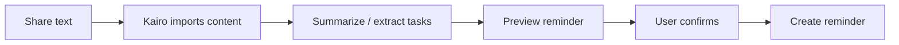

# Kairo


Kairo is an open-source iOS agent scaffold for building a practical, sandbox-compliant iPhone assistant.

It is designed for makers and Swift developers who want a real mobile agent without pretending iOS apps can bypass sandbox rules. Kairo brings together chat, memory, share-sheet ingestion, App Intents, internal recipes, tool catalogs, model routing, action previews, and explicit confirmation inside App Store-safe boundaries.

> Product principle: if iOS allows a capability through public APIs, user consent, App Intents, Shortcuts, extensions, URL handoff, or official provider APIs, Kairo should make it useful. If iOS does not allow it, Kairo should say so and offer a safe alternative.

## What Kairo can do

### Chat with memory

- Ask questions in a chat-first iPhone app.
- Keep persistent chat history.
- Save, search, delete, purge, and export long-term memory.
- Use user-approved memory as context for future answers.
- Run private chat paths that avoid memory lookup and fail closed for local-only routing when no local model is available.

### Turn shared content into actions

- Share text, URLs, images, PDFs, and file metadata into Kairo.
- Import shared content through a queue-only Share Extension.
- Summarize shared content in chat.
- Extract tasks and draft next steps.
- Create reminder or calendar drafts from shared material.

### Preview and confirm actions

- Create reminders through EventKit Reminders.
- Create calendar events through EventKit Calendar.
- Schedule local notifications through UserNotifications.
- Create contacts through Contacts.framework.
- Open visible handoffs for email, messages, phone, web search, and Apple Maps.
- Always show a preview before a write, notification, or external handoff.

### Automate through Shortcuts

- Use App Intents as small, safe nodes.
- Run Kairo Recipes, which are Kairo-owned internal workflows.
- Return structured JSON for downstream Apple Shortcuts.
- Keep high-risk nodes draft/preview oriented.
- Do not silently create or edit Apple Shortcuts.

### Manage tools and models

- Show available and installed tools in Skill Manager.
- Install, disable, enable, remove, and preview signed skill manifests.
- Refresh a local model catalog, download models, select a preferred model, and delete installed models.
- Choose route preferences such as automatic, prefer local, prefer cloud, or local only.
- Keep macOS/dev local model runtime checks separate from iPhone production inference.

## Example flows

### Flow A: Shared text to reminder

Share a paragraph, note, or task list into Kairo. Kairo imports it into chat, summarizes it, extracts tasks, prepares a reminder preview, and waits for confirmation before writing to Reminders.



### Flow B: Chat to calendar event

Ask Kairo to schedule something from natural language. Kairo drafts the calendar fields, shows the event preview, requests EventKit permission when needed, and creates the event only after confirmation.


### Flow C: Chat to visible system handoff

Ask Kairo to draft an email, message someone, call a number, search the web, or open directions. Kairo previews the target and payload, then opens a visible system handoff after confirmation.


## Why Kairo exists

Most "phone agent" ideas either under-deliver because they stay inside one chat box, or overclaim by implying hidden access to other apps. Kairo takes the narrower but shippable path: compose the capabilities iOS actually gives apps, make every action inspectable, and keep the user in control.

For users and makers, that means an assistant that can remember context, handle shared content, turn intent into concrete drafts, and connect to safe system surfaces. For iOS developers, it is a source-first reference for building agent features with SwiftUI, App Intents, Share Extension ingestion, EventKit, UserNotifications, Contacts, URL handoff, provider credentials, skill manifests, and model catalogs.

For reviewers and security-minded developers, the boundary is explicit: Kairo is not a jailbreak tool, not an arbitrary iPhone RPA layer, and not a way to read other apps' private data.

## Sandbox-safe by design

Kairo does not claim capabilities that normal App Store apps cannot provide:

- No arbitrary reading of other apps' private data.
- No background screen watching or hidden screenshots.
- No unprompted control of other app UIs.
- No private APIs, jailbreak APIs, background daemons, or permission bypasses.
- No Apple Mail, Messages, Notes, Safari, or ChatGPT web-session scraping.
- No silent Apple Shortcuts creation or modification.

Instead, Kairo uses iOS-supported entry points:

- Share Extension for user-shared content.
- EventKit for user-confirmed reminders and calendar events.
- UserNotifications for user-confirmed local notifications.
- Contacts.framework for create-only contact actions.
- App Intents and Shortcuts for user-triggered automation nodes.
- URL handoff for visible email, message, phone, web search, and maps flows.
- OAuth/API-key scaffolds for official provider integrations.
- Metadata-only audit logs for action outcomes and capability use.


## Current beta status

Use these labels when reading the code and docs:

| Status | Meaning |
|---|---|
| Implemented | Usable in the app/core path and covered by tests for the stated scope. |
| Scaffolded | Code, UI, models, or protocols exist, but production hardening remains. |
| Test-only / Mock | Deterministic test or demo path only; not a real runtime capability. |
| Planned | Accepted direction, not implemented yet. |
| Not allowed | Outside App Store-safe public API boundaries for this app. |

### Implemented

- Chat-first SwiftUI app shell.
- Persistent chat history.
- Long-term memory save/search/delete/purge/export.
- Share Extension ingestion for text, URLs, images, PDFs, and file metadata.
- Action preview and explicit confirmation flow.
- EventKit reminders and calendar actions from chat.
- UserNotifications scheduling from chat.
- Contacts create-only action from chat.
- Visible email, message, phone, web search, and Apple Maps handoffs.
- App Intents / Shortcut nodes with `schemaVersion=1` safety contracts.
- Kairo-owned internal Recipes with preview/run lifecycle.
- Metadata-only audit log persistence.
- Swift Package test coverage for core safety, lifecycle, catalog, and fail-closed behavior.

### Scaffolded

- Skill Manager marketplace lifecycle, signed manifest preview/install/update, compatibility gates, and effective tool catalog.
- Local model catalog/download/select/delete. The built-in starter catalog currently Qwen3.5 0.8B and Llama 3.2 1B, with progress/cancel UI, license approval, cleanup, checksum, and trust-store verification exist; remaining blockers are production signed catalog/public-key publication and real-device runtime proof.
- OAuth connector authorization, callback redaction, status UI, disconnect, and Keychain-backed token storage.
- Background task policy for bounded app refresh and processing work.
- HomeKit typed preview/action model and demo/test path.
- Xcode UI test target and simulator smoke coverage. These simulator/package checks are not real-device sign-off.

| Area | Status | Current scope |
|---|---|---|
| Local model catalog/download/select/delete | Scaffolded | User-triggered catalog/download/settings path, progress/cancel UI, license approval, cleanup, checksum, and trust-store verification exist; remaining blockers are production signed catalog/public-key publication and real-device runtime proof. |

### Planned or deliberately deferred

- iOS production local model inference runtime.
- Production signed model catalog and public trust material from the planned standalone `kairo-models` repo.
- Additional real OAuth provider API integrations beyond the current scaffolds.
- Real HomeKit entitlement/live-control path.
- Keyboard Extension.
- Widget.

### Not allowed

- Arbitrary cross-app UI clicking.
- Background screen watching.
- Reading Messages, Mail, Notes, Safari history, or other private app stores.
- ChatGPT browser-session takeover.
- Silent Shortcut creation or modification.

## Product architecture

Kairo is split so the user-facing app stays simple while safety, routing, permissions, and persistence live in testable core services.

```text
SwiftUI App
  - Chat
  - Memory Center
  - Access / Skill Manager
  - Settings
  - Action Preview
        |
        v
KairoBackendAPI
  - Chat API
  - Memory API
  - Share Import API
  - Recipe API
  - Local Model API
  - Skill API
  - Settings / OAuth API
  - Access API
        |
        v
Agent Core
  - Planner
  - Memory retrieval
  - Safety policy engine
  - Capability registry
  - Tool invocation planner
  - Audit logger
        |
        v
iOS System Surfaces
  - App Intents / Shortcuts
  - Share Extension
  - EventKit
  - UserNotifications
  - Contacts.framework
  - URL handoff
```

The core rule is simple: the model can propose, Kairo can preview, but writes and external handoffs require a user-visible confirmation path.


## Repository layout

```text
kairo/
├── Assets/                         # SVG logo, icon, cover, and README visuals
├── Config/                         # Info.plist and purpose-string notes
├── Kairo/
│   ├── App/                        # SwiftUI app entry point
│   ├── Extensions/ShareExtension/  # Share ingestion
│   ├── Intents/                    # App Intents
│   ├── Models/                     # Agent, chat, attachment, memory models
│   ├── Resources/                  # Privacy manifest
│   ├── Services/                   # Stores, providers, permissions, actions
│   └── Views/                      # SwiftUI screens and components
├── Tests/                          # Swift Package tests
├── Website/                        # Static skill/model catalog seeds
├── docs/                           # Product, architecture, safety, release docs
├── Package.swift
└── project.yml                     # XcodeGen project scaffold
```

## Quick start

Run the package tests:

```bash
swift test
```

Generate the Xcode project:

```bash
xcodegen generate
```

Generate an Xcode project that embeds the local `llama.xcframework` runtime after bootstrapping it:

```bash
scripts/bootstrap_llama_xcframework.sh
scripts/generate_xcodeproj_with_local_runtime.sh
```

The package is intentionally dependency-light. Core logic lives in `KairoCore` so safety and lifecycle behavior can be tested without relying on a simulator for every change.

## Roadmap priorities

1. Finish real-device beta sign-off before release for Chat, Memory, Access, Settings, Share Extension import, App Intents Ask/Save/Search, restart persistence, notification/reminder/calendar previews, and email/message/phone/web/maps handoffs.
2. Publish production signed catalogs and public trust material for `kairo-skills` and the planned `kairo-models`.
3. Keep iOS production local inference marked Planned until an App Store-compatible runtime is implemented and verified on physical devices.
4. Keep Keyboard Extension, Widget, real HomeKit live control, and additional OAuth providers deferred until stabilization blockers are closed.

## Documentation

- [Architecture](docs/ARCHITECTURE.md)
- [Capability matrix](docs/CAPABILITY_MATRIX.md)
- [Safety and privacy](docs/SAFETY_AND_PRIVACY.md)
- [OpenAI/auth strategy](docs/AUTH_OPENAI.md)
- [Local model fallback](docs/LOCAL_MODEL_FALLBACK.md)
- [Recipe engine](docs/RECIPE_ENGINE.md)
- [Shortcuts strategy](docs/SHORTCUTS_STRATEGY.md)
- [Skill management](docs/SKILL_MANAGEMENT.md)
- [App Store readiness](docs/APP_STORE_READINESS.md)
- [Roadmap](docs/ROADMAP.md)

## Brand assets


- App icon source: [Assets/kairo-app-icon.svg](Assets/kairo-app-icon.svg)
- GitHub cover / social preview source: [Assets/github-readme-cover.svg](Assets/github-readme-cover.svg)
- Capability overview: [Assets/github-capability-board.svg](Assets/github-capability-board.svg)
- Shortcut recipes overview: [Assets/github-shortcut-recipes.svg](Assets/github-shortcut-recipes.svg)

## License

MIT. See [LICENSE](LICENSE).

Third-party runtime and local-model license handling is tracked in
[`Kairo/Resources/ThirdPartyNotices.md`](Kairo/Resources/ThirdPartyNotices.md)
and [`docs/LOCAL_MODEL_LICENSE_COMPLIANCE.md`](docs/LOCAL_MODEL_LICENSE_COMPLIANCE.md).
