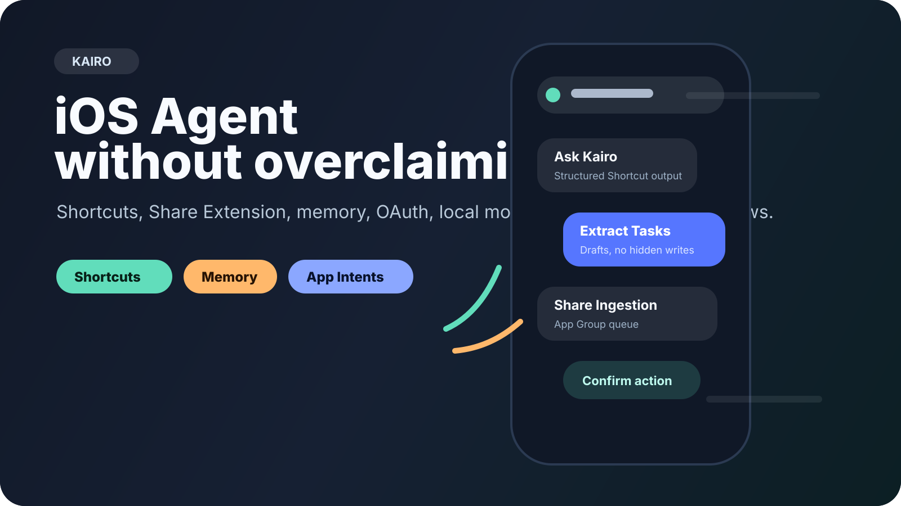
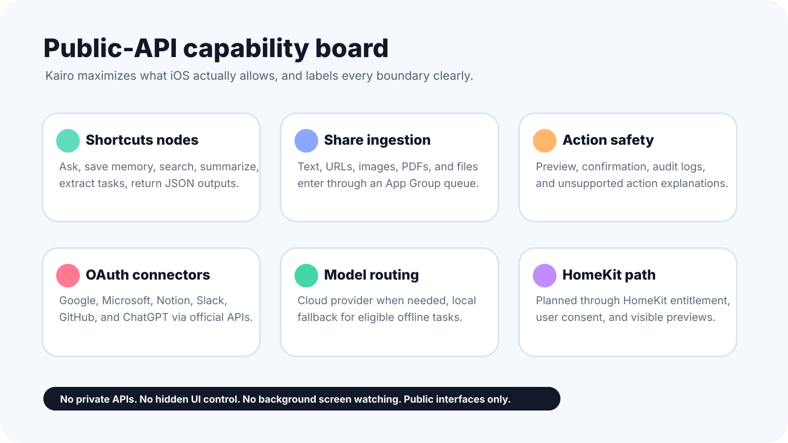
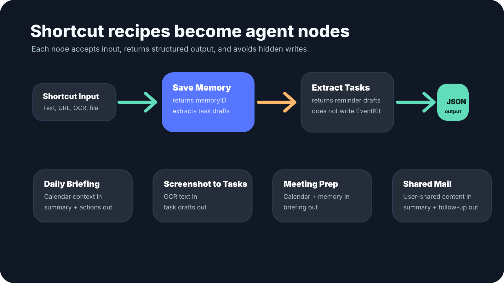
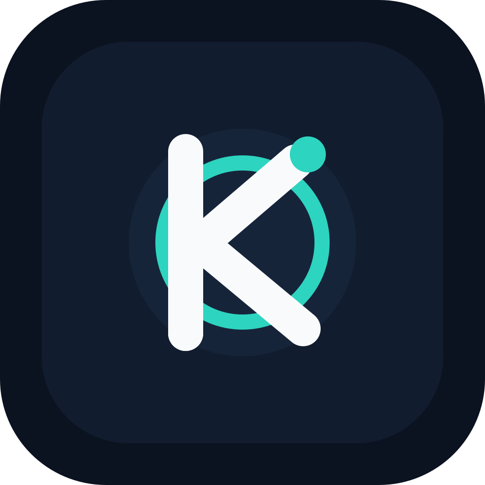

# Kairo



Kairo is an open-source Swift/SwiftUI iOS agent scaffold for building a **universal, sandbox-compliant iPhone assistant**. It combines chat, long-term memory, Share Extension ingestion, App Intents/Shortcuts, permission-aware tools, audit logs, OpenAI-compatible cloud models, and local-model fallback planning without pretending iOS apps can bypass sandbox rules.

> Product principle: if a capability is allowed by user consent, iOS public APIs, App Intents, Shortcuts, extensions, or official third-party APIs, Kairo should make it useful. If iOS does not allow it, Kairo must explain the boundary and offer a safe alternative.

## What Kairo is

Kairo is a source-first iOS agent reference implementation for developers who want to ship an App Store-safe assistant that can:

- Chat with the user and preserve conversation history.
- Remember user-approved facts in an editable memory store.
- Understand files, links, text, and images shared into the app.
- Preview sandbox-safe actions before execution.
- Use App Intents and Shortcuts for user-triggered automation.
- Call official model/provider APIs or route eligible work to a local fallback model.
- Keep a clear audit trail of what the agent saw, suggested, and did.

## Sandbox-first scope

Kairo does **not** promise capabilities that normal App Store apps cannot provide:

- Arbitrary reading of other apps' private data.
- Background screen watching or screenshots.
- Unprompted control of other app UIs.
- Permission bypasses, private APIs, jailbreak-only APIs, or background daemons.
- Unapproved access to Messages, Mail, Notes, or ChatGPT web sessions/cookies.

Instead, Kairo uses iOS-supported entry points: Share Extension, document/photo pickers, EventKit, UserNotifications, App Intents, Shortcuts, URL opening, OAuth connectors, and explicit user confirmation.

## Current implementation

- Swift Package product: `KairoCore`.
- SwiftUI app scaffold: Chat, Memory Center, Access/Permissions, Settings.
- Persistent chat threads with JSON-backed history store.
- Memory store protocols plus in-memory and JSON file implementations.
- OpenAI provider abstraction, credential store, Keychain-backed credential store, and OAuth/PKCE scaffold.
- Local-model catalog/install registry and provider-routing scaffold.
- Capability registry, sandbox action catalog, safety policy engine, action preview UI, and sandbox action executor.
- Popular app integration registry covering App Intents, Shortcuts, URL schemes/universal links, Share Extension handoff, and OAuth connector metadata.
- BGTaskScheduler-compatible background task policy for bounded app refresh/processing work without daemon overclaims.
- Share Extension ingestion queue for text, URLs, files, and images.
- Structured Shortcut node runtime and App Intents for asking, saving, searching, summarizing, and task extraction.
- HomeKit-safe action model and executor injection for confirmed scene/accessory control.
- App icon source plus GitHub/README visual assets.
- Privacy manifest, purpose-string notes, capability matrix, App Store readiness docs, and unit tests.

## Visual overview





## Brand assets



- App icon source: [Assets/kairo-app-icon.svg](Assets/kairo-app-icon.svg)
- GitHub cover / social preview source: [Assets/github-readme-cover.svg](Assets/github-readme-cover.svg)
- Capability overview: [Assets/github-capability-board.svg](Assets/github-capability-board.svg)
- Shortcut recipes overview: [Assets/github-shortcut-recipes.svg](Assets/github-shortcut-recipes.svg)

## Repository layout

```text
kairo/
├── Assets/                         # Open-source SVG logo, icon, and GitHub visual assets
├── Config/                         # Info.plist and purpose-string notes
├── Kairo/
│   ├── App/                        # SwiftUI app entry point
│   ├── Extensions/ShareExtension/  # Share ingestion scaffold
│   ├── Intents/                    # App Intents scaffold
│   ├── Models/                     # Agent, chat, attachment, memory models
│   ├── Resources/                  # Privacy manifest
│   ├── Services/                   # Stores, providers, permissions, actions
│   └── Views/                      # SwiftUI screens and components
├── Tests/                          # Swift Package tests
├── docs/                           # Product, architecture, safety, release docs
├── Package.swift
└── project.yml                     # XcodeGen project scaffold
```

## Quick start

```bash
swift test
```

Optional Xcode project generation:

```bash
xcodegen generate
```

The package is intentionally dependency-free. The iOS app target is described in `project.yml`; the core logic stays in `KairoCore` so it can be tested without an iOS simulator.

## Product roadmap

1. App target hardening: entitlements, App Group, Share Extension UI, widgets.
2. Memory and chat persistence migration to SwiftData/Core Data for production apps.
3. Real provider integrations: OpenAI Responses API, official OAuth connectors, optional backend proxy, and provider-specific app review/security requirements.
4. Tool execution: EventKit writes, local notifications, URL/deep-link handoff, Shortcuts/App Intents, documents/photos import.
5. Bounded background work: BGAppRefreshTask/BGProcessingTask registration, checkpointing, expiration handling, and user-visible rescheduling.
6. Local model fallback: signed model catalog, download UI, device gating, safety policy versioning.
6. App Store readiness: privacy nutrition labels, review notes, permission prompts, deletion/export flows.

## Documentation

- [Architecture](docs/ARCHITECTURE.md)
- [Capability matrix](docs/CAPABILITY_MATRIX.md)
- [Safety and privacy](docs/SAFETY_AND_PRIVACY.md)
- [OpenAI/auth strategy](docs/AUTH_OPENAI.md)
- [Local model fallback](docs/LOCAL_MODEL_FALLBACK.md)
- [Shortcuts strategy](docs/SHORTCUTS_STRATEGY.md)
- [App Store readiness](docs/APP_STORE_READINESS.md)
- [Roadmap](docs/ROADMAP.md)

## License

MIT. See [LICENSE](LICENSE).
